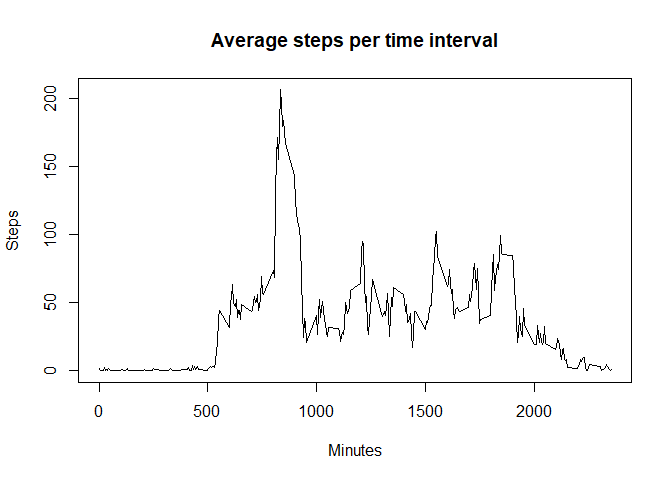

## Loading and preprocessing the data
1- Load the data (i.e. read.csv())
2- Process/transform the data (if necessary) into a format suitable for your analysis

dates were converted


```r
df <- read.csv("./activity.csv")
df$date <- as.Date(df$date)
```


## What is mean total number of steps taken per day?
sumerize steps over all intervals for each day

```r
steps_per_day <- aggregate(df["steps"], by = list(date = df$date), sum, na.rm = TRUE)
```

Make a histogram of the total number of steps taken each day

```r
hist(steps_per_day$steps, main = "Total number of steps per day", xlab = "Steps", breaks = 10)
```

<!-- -->

Calculate and report the mean and median total number of steps taken per day

```r
mean <- mean(steps_per_day$steps, na.rm = TRUE)
median <- median(steps_per_day$steps, na.rm = TRUE)
```
Mean is 9354.2295082, and median is 10395

## What is the average daily activity pattern?
aggregate over intervals

```r
mean_interval <- aggregate(df["steps"], by = list(interval = df$interval), FUN = mean, na.rm = TRUE)
```
Make a time series plot (i.e. type = "l") of the 5-minute interval (x-axis) and the average number of steps taken, averaged across all days (y-axis)

```r
plot(x = mean_interval$interval, y = mean_interval$steps, type='l', xlab = "Minutes", ylab = "Steps", main = "Average steps per time interval")
```

<!-- -->

Which 5-minute interval, on average across all the days in the dataset, contains the maximum number of steps?

```r
maxSteps = max(mean_interval$steps);
maxStepsAt = which.max(mean_interval$steps);
maxAtInterval = mean_interval$interval;
```
intervals number 104 has on average the maximum number of steps of 206.1698113


## Imputing missing values
1. Calculate and report the total number of missing values in the dataset (i.e. the total number of rows with NAs)

```r
total_numnber_of_missing_values <- length(which(is.na(df$steps)))
```

a totla of 2304 rows have a missing steps value.

2. Devise a strategy for filling in all of the missing values in the dataset. The strategy does not need to be sophisticated. For example, you could use the mean/median for that day, or the mean for that 5-minute interval, etc.

use the mean of the interval for the missing steps to fill in values


3. Create a new dataset that is equal to the original dataset but with the missing data filled in.

```r
df2 <- data.frame(df)


for (i in 1:length(df$steps)) {
  if (is.na(df2$steps[i])) {
    df2$steps[i] = mean_interval$steps[which(mean_interval$interval == df2$interval[i])]
  }
}
```

4. Make a histogram of the total number of steps taken each day and Calculate and report the mean and median total number of steps taken per day. Do these values differ from the estimates from the first part of the assignment? What is the impact of imputing missing data on the estimates of the total daily number of steps?

```r
steps_per_day2 <- aggregate(df2["steps"], by = list(date = df2$date), sum, na.rm = TRUE)

hist(steps_per_day2$steps, main = "Total number of steps per day (NAs filled)", xlab = "Steps", breaks = 10)
```

<!-- -->

```r
mean2 <- mean(steps_per_day2$steps)
median2 <- median(steps_per_day2$steps)
```
|               | steps         | steps with filled in NAs  |
| ------------- |:-------------:| -----:|
| mean          | 9354.23      | 10766.19     |
| median        | 10395.00    |   10766.19 |

## Are there differences in activity patterns between weekdays and weekends?

Create a new factor variable in the dataset with two levels -- "weekday" and "weekend" indicating whether a given date is a weekday or weekend day.


```r
for (i in 1:length(df2$steps)) {
  df2$dayType[i] <- if(weekdays(df2$date[i]) %in% c("Saturday", "Sunday")) "weekend" else "weekday"
}
```

Make a panel plot containing a time series plot (i.e. type = "l") of the 5-minute interval (x-axis) and the average number of steps taken, averaged across all weekday days or weekend days (y-axis). The plot should look something like the following, which was created using simulated data:


```r
total_Steps <- aggregate(df2$steps, list(dayType = df2$dayType, interval = df2$interval), 
                       data = df2, mean)
library(lattice)
xyplot(x ~ interval | dayType, data = total_Steps, type = "l", layout = c(1, 2), 
       xlab = "Interval", ylab = "Number of Steps")
```

<!-- -->
